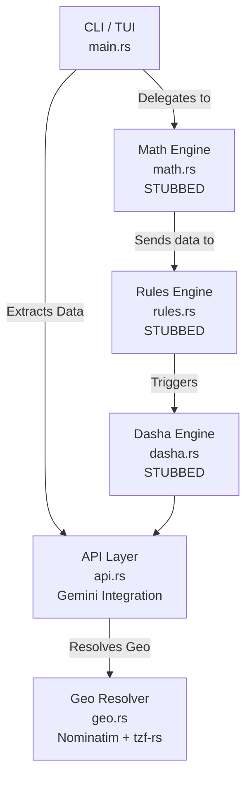

# Architecture



## Key Engineering Patterns

### 1. Custom Rate-Limit Backoff (3-Tier)

The API layer (`api.rs`) implements a production-grade retry strategy:

| Priority | Source | Mechanism |
|----------|--------|-----------|
| 1st | Error message body | Regex-parses `"retry in Xs"` / `"retry after Xs"` from Gemini's JSON error payload |
| 2nd | HTTP header | Reads the standard `Retry-After` response header |
| 3rd | Exponential jitter | `base_ms * 2^attempt` with random jitter, floored at 30s, capped at 120s |

### 2. Connection Tearing

Free-tier APIs enforce per-minute rate limits. Holding idle connections across 30–60s cooldowns causes `connection reset` errors. The client is configured to aggressively recycle:

```rust
reqwest::Client::builder()
    .tcp_keepalive(None)           // Disable TCP keepalive
    .pool_idle_timeout(5s)         // Tear idle connections after 5s
    .pool_max_idle_per_host(1)     // Max 1 idle connection per host
    .timeout(120s)                 // Allow long generation times
```

### 3. Multi-Agent Pipeline

| Agent | Role | Model |
|-------|------|-------|
| Agent 1 | Structured data extraction (temporal target parsing) | `gemini-3.1-flash-lite` |
| Agent 2 | Long-form analytical generation conditioned on deterministic data | `gemini-3.1-flash-lite` |

A mandatory 31-second inter-agent cooldown prevents back-to-back rate limiting on free-tier quotas.

### 4. Data Anonymization Layer

Client PII is stripped from the prompt payload before API submission — names are replaced with generic identifiers so the external LLM never sees real client data.